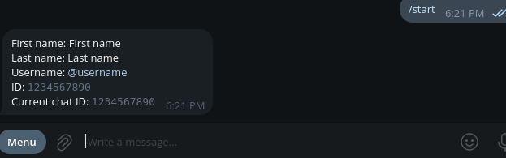

# Get Telegram ID bot

## Features

- works in DMs
- works in group chats
- contact support
- aiogram 3.x
- inline mode support (make sure to enable it)

[Live example](https://t.me/get_id_tg_bot)

<details>
  <summary>Preview</summary>
  
</details>

## Installing

Download the repository and go to the directory

```sh
git clone https://gitlab.com/cooltgbots/get-telegram-id-bot.git 
cd get-telegram-id-bot
```

Install the requirements

```sh
pip install -r requirements.txt
```

Run the bot 

```sh
cd src/
python main.py
```

## Docker setup

You can use `docker compose` to run this bot

```sh
cp docker-compose.example.yaml docker-compose.yaml
docker compose up
```

## Configuration

Get your API key by messaging [@botfather](https://t.me/botfather) 

Create `.env` file and put the key inside `TOKEN` variable

```env
TOKEN=1234567890:AAAAAAAAAAAAAAAAAAAAAAAAAAAAAAAAAAA
```
